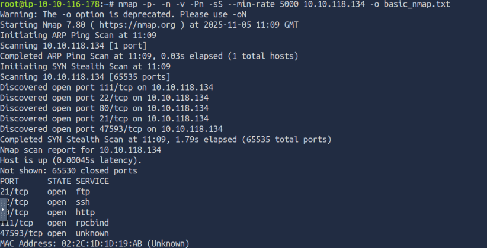

# Lian_Yu
**URL:** https://tryhackme.com/room/lianyu
**Dificultad:** Fácil 
**Fecha:** 05/11/2025  
**Autor:** oscur388

---

## 🎯 Objetivo
Sala ambientada en la serie de ciencia ficcion Arrow. Esta centrada en la enumeracion web y de servicios, uso de FTP, steganografia, SSH y escalada de privilegioss

## 🧭 Enumeración
Lo primero que haremos será un escaneo rápido de la ip que nos han proporcionado usando nmap.

Hemos obtenido una serie de puertos abiertos y ahora realizaremos un escaneo algo mas profundo para obtener algo mas de información.

Como tenemos un puerto 80 abierto vamos a ver que hay. Abrimos el navegador y escribimos la ip proporcionada.

## ⚙️ Explotación
Ahora vamos a usar Gobuster para realizar Fuzzin y ver si existen ficheros o subdirectorios dentro del servidor web.

Hemos obtenido un ruta dentro de la principal. Vamos a ver en el navegador que tiene. (Recomendacion: Una vez dentro, inspeccionar el código fuente)

Habia un secreto verdad? (Es bueno anotar todo lo que encontramos en los CTF's, por si nos es útil mas adelante)

Ahora volvemos a hacer Fuzzin del subdirectorio encontrado para ver si tiene mas subcarpetas o ficheros en su interior.

Hemos encontrado otro subdirectorio, vamos a verlo en el navegador.

Aqui hay una pista que podemos utilizar para continuar. 
Vamos a volver a usar Gobuster, pero esta vez solo vamos a buscar por un formato de extension, el que hemos obtenido en la pista anterior.

Hemos encontrado un archivo dentro de la ultima ruta escaneada. Vamos a ver en el navegador que es lo que contiene.

Hemos encontrado una cadena de caracteres que parece que se encuentra codificada. O nos sabemos de memoria los tipos de codificacion o tambien podemos buscar
alguna herramienta que nos ayude a detectar la codificacion. A mi me gusta usar en primera instancia la web de dcode.fr

Viendo las dos primeras opciones de codificacion yo me inclino por una de ellas, pero es conveniente a que probemos las dos. Vamos a probar con aquella que creo que 
puede ser.

Hemos obtenido lo que parece ser una contraseña. Ahora vamos a recopilar.
Durante la enumeracion y un poco la explotacion del servidor web hemos encontrado lo que parece ser un Usuario y ahora una contraseña. Tambien hemos encontrado tanto un puerto
21 y un puerto 22 abierto, es decir, FTP y SSH. Vamos a probar en FTP con el usuario y la contraseña que tenemos.

Estamos dentro de FTP. Vamos a listar a ver que hay dentro del directorio del usuario con el que hemos accedido.

Como hemos podido ver, hay 3 imágenes. Vamos a descargarla y ver que tiene cada una de ellas.
Tambien podemos indagar un poco en el FTP. Vamos a intentar movernos de directorio hacia arriba, a ver si tenemos permiso para cambiar de directorio.

Teniamos permiso para subir un directorio y podemos ver que existe otro usuario mas en el sistema. Nos servirá esto mas adelante?

Ahora nos salimos del FTP y vamos a examinar las imagenes que hemos descargado.
Si desde el explorador de archivos nos vamos a donde se han descargado las imágenes podemos observar que dos de ellas las podemos abrir, pero la que tiene el nombre
mas llamativo está corrupta. Aqui podemos usar varias herramientas contra las imágenes descargadas para ver si nos aportan algo mas de informacion (binwalk,steghide,file,Strings...).
Despues de investigar un poco he observado que la imagen corrupta se debe a que han modificado la cabecera. Como sé esto? Pues muy sencillo, ya que tenemos otra imagen .png con la que comparar. Si usamos el comando "xdd" podemos ver la cabecera de una imagen. Aqui, en la siguiente captura, podemos ver que ambas imágenes son .png pero tienen cabeceras distintas

Ahora lo que debemos hacer es volver a modificar la cabecera y escribir los bits correctos de la cabecera de los ficheros .png

Ahora que la imagen ya tiene la cabecera correcta podemos abrirla. Al abrirla podemos ver que contiene una contraseña (seguro al 100%) que podremos usar.

Si antes investigaste un poco sobre las imágenes descargadas, podrias comprobar que cuando usas la herramienta "steghide" te pide una passphrase. Es posible que la contraseña encontrada sea esa passphrase no?

Se nos ha descargado un zip  ya que la imagen lo contenía en su interior. Vamos a descomprimir ese zip y veamos que tiene dentro.

Tenemos dos archivos. Si los inspeccionamos los dos veremos que uno de ellos nos devuelve lo que parece ser una contraseña. Ahora tenemos una contraseña pero no tenemos un usuario como tal no? o si? Aqui estuve un poco atascado hasta que recordé que sí, que descubrimos un usuario en el FTP.
Asi que vamos a probar a traves de SSH si es posible conectarnos como dicho usuario.

Bingo!! Hemos accedido mediante ssh con el usuario y la contraseña obtenidos.
Ahora vamos a listar el directorio en el que nos encontramos a ver que hay.

Aqui obtenemos la Primera Flag, la del usuario.

## 🧑‍💻 Escalada de privilegios
Ahora toca realizar la escalada de privilegios. Ya que estamos en el sistema como un usuario, vamos a intentar conseguir acceso de root.
Lo primero que debemos hacer es usar el comando "sudo -l" para ver si el usuario con el que estamos dentro tiene permisos de ejecutar algo como root.

Como podemos ver podemos usar la herramienta "pkexec" para ganar acceso de root. (recomiendo investigar un poco sobre la herramienta encontrada si no la conoces para ver para que se utiliza)

La herramienta "pkexec" se utiliza para lanzar herramientas o comandos como root sin tener que usar sudo.
Asi que vamos a probar a usar la herramienta "pkexec" con la herramienta "cat" para intentar leer la Flag de root

Y ya hemos conseguido escalar los privilegios y conseguir la ansiada Flag del usuario Root.

## 🧩 Lecciones aprendidas
Escaneo básico y algo mas profundo con NMAP
Uso de Gobuster añadiendo varias extensiones.
Steanografia
Decodificar cadenas codificadas
Uso de la herramienta pkexec para la escalada de privilegios. 

---

> ⚠️ **Nota:** Los flags se omiten o se sustituyen por `[FLAG REDACTED]`.