# Título del CTF
**URL:** https://tryhackme.com/room/easyctf
**Dificultad:** Fácil 
**Fecha:** 06/11/2025
**Autor:** Oscur388

---

## 🎯 Objetivo
Enumeracón de la maquina, busqueda de vulnerabilidades, explotar dichas vulnerabilidades y escalar privilegios para conseguir acceso Root.

## 🧭 Enumeración
Lo primero que haremos, como siempre, será un escaneo básico de la IP proporcionada para la máquina que hemos iniciado.

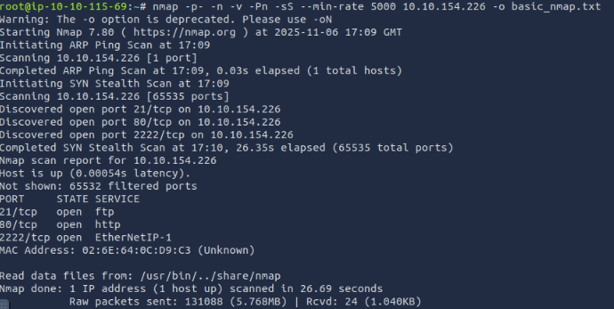

Una vez que hemos optenido los puertos que se encuentran abiertos, vamos a realizar un escaneo algo más profundo pero dirigido especialmente a los puertos abiertos que hemos descubierto en el paso anterior

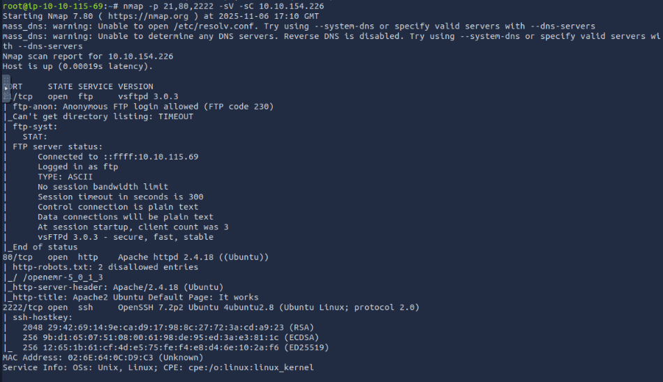

Como hemos podido apreciar, tenemos un FTP (puerto 21), un servidor Web (Puerto 80) y un SSH en un puerto no habitual (puerto 2222). 
Vamos a ir por orden, por lo que primero vamos a revisar el Servicio FTP.

Antes de intentar fuerza bruta contra un servicio FTP abierto, podemos probar con el acceso anónimo. Vamos a probar con el usuario "anonymous"

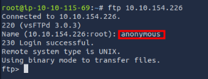

Hemos podido acceder, por lo que vamos a ver en que directorio nos encontramos y vamos a listarlo para ver que tiene dentro.
Una vez que hemos listado el directorio vemos que solo existe una carpeta, por lo que accederemos a ella y volvemos a listar. 
Encontramos un archivo .txt asi que vamos a descargarlo a nuestra máquina para leerlo más tarde.

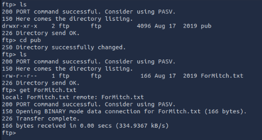

Nos salimos del FTP y procedemos a leer el archivo descargado.
Al parecer, un usuario le envía una nota a "Mitch" indicandole que su contraseña es insegura y que ha podido descifrarla con facilidad. ¿Puede ser Mitch un usuario explotable?

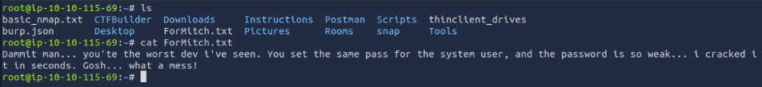

Como por aqui no podemos seguir por ahora, por que no estamos seguros de que Mitch sea usuario y no tenemos contraseña, vamos a ir contra el servicio del puerto 80.
Lo que haremos será usar Gobuster contra la dirección IP que tenemos.

## ⚙️ Explotación

Vemos una carpeta y un archivo .txt que merecen ser revisados.
El fichero .txt se llama "robots.txt" y contiene información de lo que no se indexa en el buscador. Al revisarlo no vemos una informacion demasiado importante. Vamos a ir ahora a revisar el subdominio"/simple"

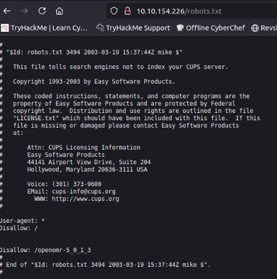

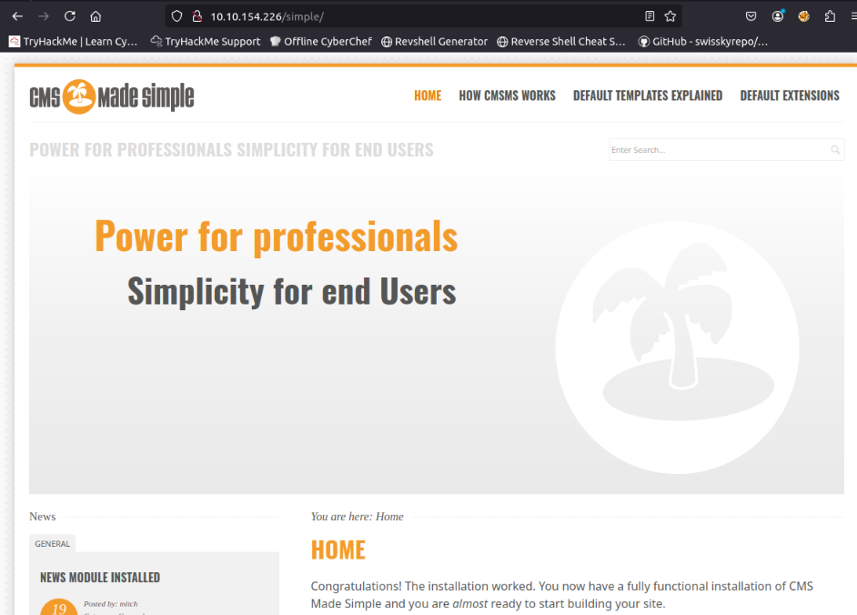

Aqui si podemos encontrar algo mas de informacion. Es un CMS o Gestor de Contenido. Vamos a revisar en primer lugar si podemos encontrar la version de dicho CMS y si existe algun exploit en internet que podamos usar contra dicho CMS.

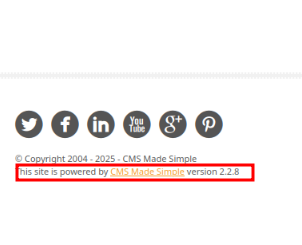

Como podemos ver al final de la pagina, el CMS esta mostrando la versión. Podemos buscar en la web de "Exploit-DB" si existe algun exploit para dicha versión.

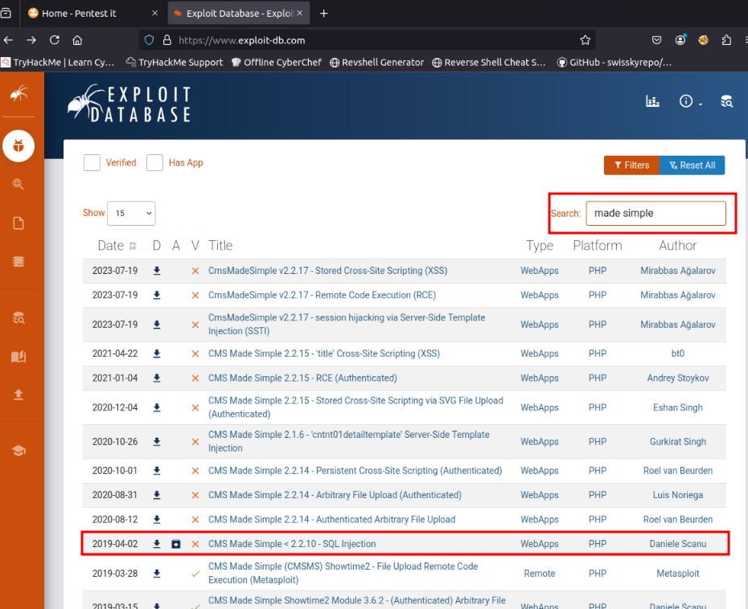

Existe un exploit que indica que se utiliza para versiones inferiores a la 2.2.10 (la nuestra es inferior a esa), por lo que podemos utilizar dicho exploit. 
Accedemos a ese enlace y lo descargamos en nuestro sistema. 
Es importante revisar el código del exploit que vayamos a usar, pues a veces es necesario modificar algún parámetro para adaptarlo a nuestras necesidades. También es buena práctica leer el código del exploit para saber que hace y que parámetros de entrada necesita dicho exploit. 

Una vez leído el código del exploit vamos a usarlo.
Tenemos la opción de que haga un ataque de fuerza bruta si le pasamos un diccionario. Pues vamos a ello.

Una vez que ha acabado, podemos ver que nos ha devuelto un nombre de usuario, un email, la contraseña encriptada y el propio exploit la desencripta, por lo que ya tenemos la contraseña del usuario.

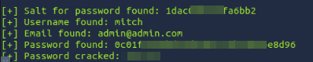

Ahora podemos hacer login en el CMS pero tambien podemos intentar accceder a traves de SSH. Vamos a comprobar las dos partes.
Primero vamos a cmprobar si podemos entrar el CMS.

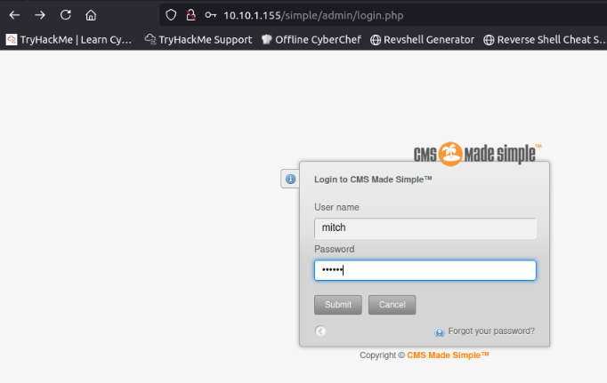

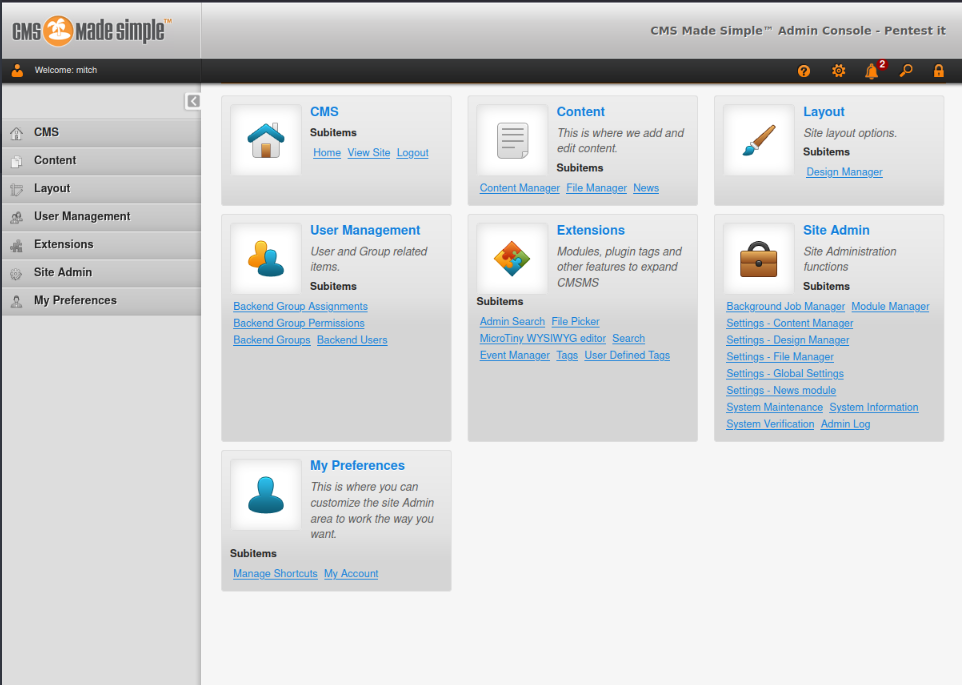

Hemos comprobado que tenemos acceso como usuario administrador. Es conveniente que revisemos el CMS para ver si encontramos alguna informacón válida. Esto te lo dejo a ti (lector) para que te entretengas un rato y cojas la rutina de revisar lo que encuentras.

Ahora vamos a comprobar si tenemos acceso por SSH.

¡¡ RECUERDA QUE EL SERVICIO SSH NO ESTÁ EN SU PUERTO HABITUAL!!

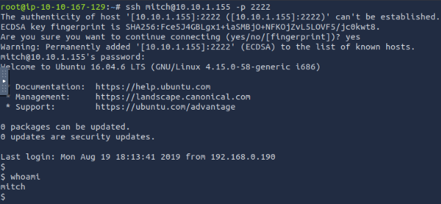

Perfecto, tenemos acceso a SSH como Mitch.

Ahora debemos comprobar en que directorio estamos y que hay dentro. 

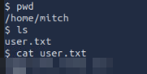

Estamos dentro de home del usuario con el que hemos accedido y tenemos el archivo .txt de su Flag. Revísalo para obtenerla.

Ahora sería una buena práctica revisar si en el sistema existen mas usuarios. Es bueno mirarlo para saber si hay otras maneras de escalar privilegios.

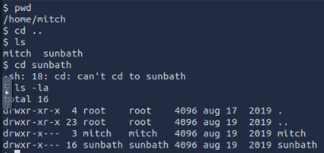

No resulta un poco "fea" la interfaz que estamos usando como shell? ¿Sabes que puedes cambiarla con un simple comando en python? Te lo muestro.

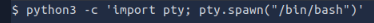

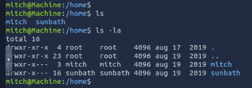

A que ahora se ve mucho mejor y mas atractiva al uso?

## 🧑‍💻 Escalada de privilegios

COmencemos con la escalada de privilegios que es la "parte final" del reto como norma general.

Ejecutamos el comando "sudo -l" para ver que permisos de ejecucion tiene el usuario actual como root.

Como podemos observar, es posible usar vim como root sin necesidad de usar la contraseña, por lo que vamos a usarlo.

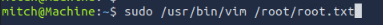

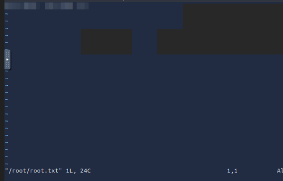

Ya tenemos la Bandera o Flag del root. 

Enhorabuena, has superado otra máquina mas.

